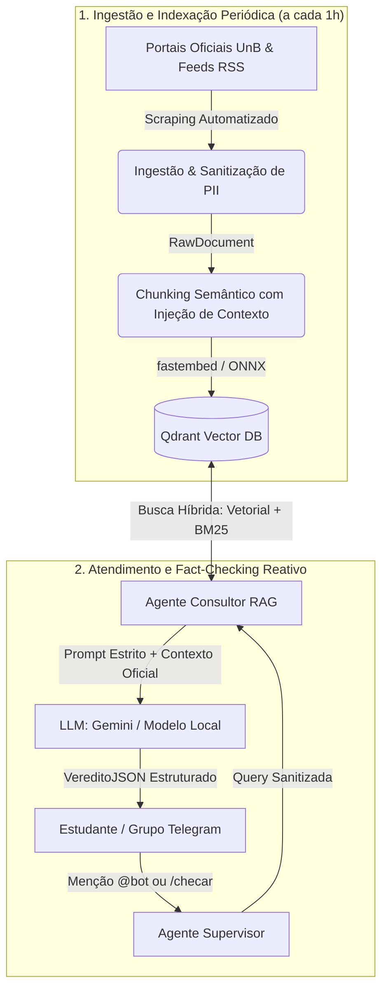

# 🏛️ FatoUnB — Inteligência e Fact-Checking Universitário

> **Sistema automatizado de verificação factual, combate à desinformação e consulta a fontes oficiais da Universidade de Brasília (UnB).**

---

## 🎯 Objetivos do Projeto

<div class="grid cards" markdown>

-   :material-briefcase-check:{ .lg .middle } **Objetivo de Negócio**

    ---

    Reduzir a incerteza e mitigar a propagação de boatos em grupos e comunidades universitárias da UnB.

    **Métrica de Sucesso:**
    * Taxa de retenção **≥ 50%** (mais de 50% dos usuários que acionaram o bot retornam para consultá-lo pelo menos 3 vezes).

-   :material-robot:{ .lg .middle } **Objetivo de Machine Learning**

    ---

    Verificar a veracidade e consistência de afirmações textuais confrontando-as estritamente com os dados e informativos oficiais da UnB via RAG.

    **Métrica de Sucesso:**
    * Confiança (*confidence score*) do modelo de veredito **≥ 50%** nas análises sobre a base indexada.

</div>

---

## 🔍 Escopo do Sistema

* **Entradas Suportadas:** Mensagens de texto em português compartilhadas em grupos do Telegram/WhatsApp relacionadas a editais, calendários acadêmicos, avisos da Reitoria e serviços da UnB (RU, bibliotecas, transporte).
* **Fora de Escopo:** Processamento de imagens (OCR de prints), transcrição de mensagens de áudio, chamadas de voz e consultas sem relação com o ecossistema institucional da UnB.

---

## 🏗️ Arquitetura Geral do Sistema


## 🚀 Como Executar Localmente

### 1. Clonar o Repositório e Sincronizar Dependências

```bash
git clone https://github.com/unb-Sistemas-de-Machine-learning/challenge_1_accio.git

cd challenge_1_accio

uv sync

uv pip install -e .
```

### 2. Rodar a Suíte de Testes
```bash
uv run pytest tests/ -v
```
### 3. Visualizar a Documentação
```bash
uv run mkdocs serve
```
