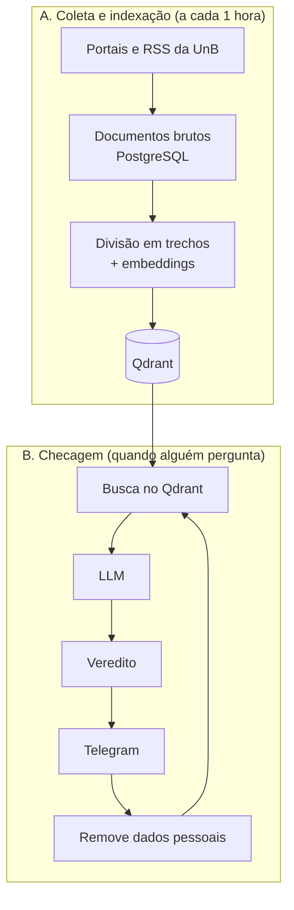

# FatoUnB

Bot de Telegram que confere afirmações sobre a UnB usando fontes oficiais da universidade.

Você manda algo como *"o RU vai fechar em outubro?"* e o bot responde com um **veredito**, uma justificativa curta e os links das fontes. A resposta vem só do que foi coletado dos portais da UnB, não do que o modelo "acha".

Projeto da Equipe Accio, disciplina Sistemas de Machine Learning (UnB, 2026.2).

---

## Objetivos

-   :material-briefcase-check:{ .lg .middle } **Negócio**

    ---

    Reduzir a incerteza e a propagação de boatos em grupos da UnB.

    **Meta:** retenção ≥ 50% (mais da metade dos usuários volta a usar o bot pelo menos 3 vezes).

-   :material-robot:{ .lg .middle } **Machine Learning**

    ---

    Verificar afirmações comparando-as com informativos oficiais da UnB, via RAG.

    **Meta:** acerto do veredito acima de 50%. Resultado atual: 90,1% ([Resultados](modulos/avaliacao/resultados-finais.md)).

---

## Como funciona

São dois fluxos independentes que se encontram no banco vetorial.

```mermaid
flowchart TD
    subgraph A ["A. Coleta e indexação (a cada 1 hora)"]
        A1[Portais e RSS da UnB] --> A2[Documentos brutos<br/>PostgreSQL]
        A2 --> A3[Divisão em trechos<br/>+ embeddings]
        A3 --> A4[(Qdrant)]
    end
    subgraph B ["B. Checagem (quando alguém pergunta)"]
        B1[Telegram] --> B2[Remove dados pessoais]
        B2 --> B3[Busca no Qdrant]
        A4 --> B3
        B3 --> B4[LLM]
        B4 --> B5[Veredito]
        B5 --> B1
    end
```

| Etapa | Código | Página |
|---|---|---|
| Coleta | `ingestion/` | [Coleta de Dados](modulos/01-coleta-dados.md) |
| Bancos | `storage/`, `vectorstore/` | [Banco Vetorial](modulos/02-banco-vetorial.md) |
| Busca | `rag/` | [Pipeline RAG](modulos/03-pipeline-rag.md) |
| Veredito | `llm/` | [Checagem com LLM](modulos/06-checagem-llm.md) |
| Bot | `bots/` | [Bot do Telegram](modulos/07-bot-telegram.md) |
| Avaliação | `evaluation/` | [Métricas](modulos/05-metricas-benchmark.md) |

## Vereditos

| Veredito | Quer dizer |
|---|---|
| ✅ `CONFIRMADO_OFICIALMENTE` | Uma fonte oficial diz o mesmo que a afirmação |
| ❌ `BOATO_SEM_REGISTRO` | Nenhuma fonte trata do assunto, ou as fontes dizem o contrário |
| ⚠️ `DESATUALIZADO_OU_FORA_DE_CONTEXTO` | Já foi verdade, ou vale para outro período |
| ❓ `INCONCLUSIVO` | Há fontes sobre o assunto, mas não bastam para decidir |

## Equipe

| Épico | Responsável |
|---|---|
| `[DATA-INGESTION]` | Pedro Henrique Inacio dos Santos |
| `[STORAGE]` | Ângelo Araujo Cordova |
| `[RAG-ENGINE]` | Yan Santos Rodrigues |
| `[BOTS-INFRA]` | Rodrigo Atila Tavares Oliveira |
| `[QA-EVALUATION]` | Matheus Pinheiro |

Para rodar o projeto, veja [Como Executar](execucao.md).
