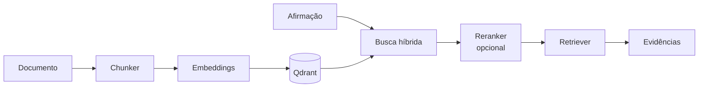

# Pipeline RAG

**Responsável:** Yan Santos Rodrigues · **Código:** `src/fato_unb/rag/`

Transforma os documentos em trechos buscáveis e, na hora da pergunta, encontra os trechos que mais se parecem com a afirmação.



## Dados (`models.py`)

**`DocumentChunk`** é o que vai para o Qdrant:

| Campo | Para quê |
|---|---|
| `content` | Trecho com cabeçalho (título, fonte, semestre). É o que vira vetor |
| `raw_text` | Trecho puro, para citação |
| `parent_text` | Janela maior ao redor, enviada ao LLM |
| `chunk_id`, `doc_id`, `chunk_index`, `total_chunks` | Identificação |
| `title`, `url`, `source`, `semester_ref`, `published_at` | Metadados para filtros e citação |

**`VereditoJSON`** é a resposta final: veredito, justificativa, fontes e confiança (0 a 1).

## Chunker (`chunker.py`)

O texto é dividido em frases (sem quebrar em abreviações como "Prof." e "Art.") e agrupado em chunks de cerca de **120 palavras**, com **1 frase de sobreposição**. Cada chunk guarda também o `parent_text`, de cerca de 300 palavras.

A ideia: **buscar com trechos pequenos** (a afirmação costuma ser uma frase) e **dar contexto grande ao LLM**.

O cabeçalho no `content` ajuda o trecho a lembrar de onde veio:

```text
[Documento: Calouros comemoram aprovação no PAS]
[Fonte: noticias.unb.br | Ref: 2026.2]

Esta segunda-feira (9) foi dia de ver gente jovem reunida...
```

Na avaliação (95 casos), o chunker novo ficou praticamente igual ao anterior (400 palavras): MRR 0,836 contra 0,853. O ganho esperado é a estrutura e o `parent_text`.

## Embeddings (`embeddings.py`)

| | Modelo | Execução |
|---|---|---|
| Denso | `intfloat/multilingual-e5-large` | Local (fastembed, ONNX, CPU) |
| Esparso | `Qdrant/bm25` | Local |

- O e5 exige os prefixos `"query: "` e `"passage: "`. O fastembed não os aplica, então o `EmbeddingService` aplica. Sem eles, a busca piora sem dar erro.
- No dataset de 95 casos, o e5-large subiu o R@1 de 0,761 para 0,943 sobre o MiniLM, ao custo de cerca de 3,7× mais tempo por consulta e 2,2 GB de memória (comentário em `embeddings.py`).
- `provider="mock"` gera vetores falsos para testes rápidos.

## Indexação (`pipeline.py`)

`IndexingPipeline.run()` pega os documentos `pending` do staging, divide em chunks, gera os vetores em lotes de 64 e grava no Qdrant. Marca cada documento como `indexed` ou `failed`.

## Busca e reranker

- **Busca híbrida:** significado (denso) + palavras exatas (BM25), combinados por RRF. Detalhes em [Banco Vetorial](02-banco-vetorial.md).
- **Reranker** (`reranker.py`): modelo que lê a afirmação e o trecho juntos para reordenar os candidatos. Está **desligado por padrão** e ainda não foi medido; liga-se com `RERANKER_MODEL`.
- **`Retriever`** (`retriever.py`): devolve evidências de páginas diferentes, descartando cópias da mesma página (`#main`, barra final). Cada evidência traz o trecho que casou e o `parent_text`.

## Testes

`tests/test_rag.py`, `test_embedding_config.py`, `test_indexing_pipeline.py` e `test_retrieval_integration.py`.
